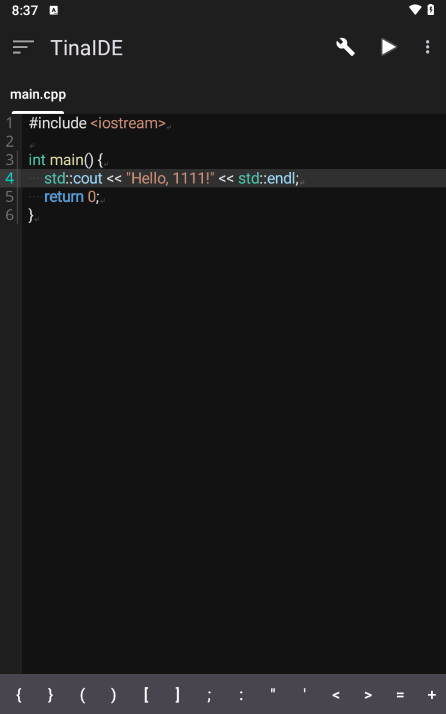
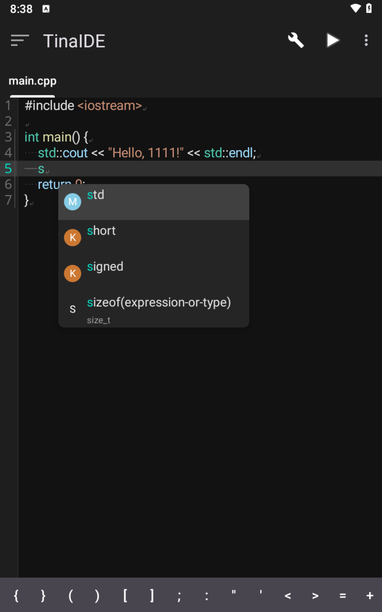

# TinaIDE

> A lightweight C/C++ IDE running on Android devices

[中文文档](README.md)

TinaIDE is an integrated development environment designed specifically for Android devices, allowing you to write, compile, and run C/C++ code directly on your phone or tablet. With a built-in complete Clang/LLVM toolchain and clangd language server, it provides a development experience close to desktop IDEs.

## Features

- **Embedded Compiler**: Built-in Clang/LLVM 17, in-process compilation, no external tools required
- **Intelligent Code Completion**: Integrated clangd LSP for precise semantic-level code completion
- **Syntax Highlighting**: High-performance incremental syntax highlighting based on Tree-sitter
- **Code Navigation**: Go to definition, find references, hover documentation
- **Real-time Diagnostics**: Display errors and warnings in real-time while editing
- **Modern Editor**: Based on Sora Editor with multi-tab editing support
- **Material Design 3**: Following the latest Material Design guidelines
- **In-process Execution**: Run compiled programs directly within the app

## UI Preview


**Code editor**: Editing `main.cpp` with the “Hello, 1111!” sample output.


**Settings hub**: Configure editor behavior, compiler optimizations, project defaults, and appearance.


**Project home**: Landing page with Alpha notice, existing projects, and a shortcut to create new ones.


**Intelligent completion**: clangd surfaces context-aware keywords, types, and functions.

## Core Features

### Compiler Integration

| Feature | Description |
|---------|-------------|
| In-process Compilation | Clang/LLVM integrated as dynamic library, no need to fork external processes |
| LLD Linker | Fast linking using LLVM LLD |
| Shared Library Output | Compile to .so files, support in-process loading and execution |
| Complete Sysroot | Android NDK headers and runtime libraries |

### LSP Language Services

| Feature | Description |
|---------|-------------|
| Code Completion | Semantic-level intelligent completion, supporting member access, headers, macros, etc. |
| Go to Definition | Quickly jump to the definition of functions, variables, and types |
| Find References | Find all usages of a symbol in the project |
| Hover Documentation | Display type information and documentation on cursor hover |
| Real-time Diagnostics | Detect syntax and semantic errors in real-time while editing |

### Editor Features

| Feature | Description |
|---------|-------------|
| Multi-tab Editing | Open multiple files simultaneously with quick switching |
| Tree-sitter Highlighting | C/C++/CMake syntax highlighting |
| Symbol Input Bar | Quick input of programming symbols (brackets, operators, etc.) |
| Undo/Redo | Complete editing history support |
| Auto Indentation | Smart code indentation |
| Line Numbers | Configurable line number area |

### Project Management

| Feature | Description |
|---------|-------------|
| File Tree Navigation | Drawer-style project file browser |
| Project Templates | Built-in single-file project template |
| compile_commands.json | Auto-generated to provide compilation configuration for LSP |

### Bottom Panel

| Tab | Function |
|-----|----------|
| Build Log | Display compilation output and error messages |
| Log | General application logs |
| Diagnostics | LSP diagnostic list, click to jump to location |

## Quick Start

### 1. Build Toolchain

```powershell
# Build LLVM/Clang toolchain (30-60 minutes for first build)
pwsh ./docker/llvm-build/build-local.ps1 -Abi arm64-v8a -ApiLevel 28

# Sync to project
pwsh ./tools/sync-llvm-build.ps1 -Abi arm64-v8a -ApiLevel 28
```

### 2. Build Application

```bash
# Build and install (Debug version)
./gradlew installDebug

# Build Release version (requires signing configuration)
./gradlew assembleRelease
```

> **Multi-ABI Build (arm64 + x86_64)**
>
> To package native libraries for both arm64-v8a and x86_64:
> ```bash
> ./gradlew assembleDebugAllAbi
> ```

### 3. Getting Started

1. Launch the app (first launch will auto-extract sysroot, takes about 1-2 minutes)
2. Create a new project or open an existing one
3. Write code (LSP automatically provides completion and diagnostics)
4. Click the run button to compile and execute

For detailed steps, see [Quick Start Guide](docs/快速开始.md)

## Documentation

- [Quick Start](docs/快速开始.md) - Start using TinaIDE from scratch
- [Architecture Overview](docs/架构概览.md) - Understand project architecture
- [Development Guide](docs/开发指南.md) - Contribute to the project
- [Documentation Center](docs/README.md) - Complete documentation index

### Technical Documentation

- [Clang/LLVM Integration Roadmap](docs/CLANG_INTEGRATION_ROADMAP.md)
- [LSP Integration Guide](docs/LSP-Integration.md)
- [Native Compile & Runtime](docs/Native-Compile-Runtime.md)
- [Bottom Panel Guide](docs/Bottom-Panel-Guide.md)

## Tech Stack

| Category | Technology |
|----------|------------|
| Languages | Kotlin, C++ |
| UI Framework | Android View + Material Design 3 |
| Editor | [Sora Editor](https://github.com/Rosemoe/sora-editor) |
| Syntax Highlighting | Tree-sitter (C/C++/CMake) |
| Compiler | Clang/LLVM 17 |
| Linker | LLD |
| LSP Service | clangd (embedded) |
| Async Processing | Kotlin Coroutines |
| Build System | Gradle + CMake |
| Dependency Injection | Custom ServiceLocator |

## Supported Architectures

| Architecture | Status | Usage |
|--------------|--------|-------|
| `arm64-v8a` | ✅ Primary | Physical devices |
| `x86_64` | ✅ Supported | Emulators |

**Target API Level**: 28+ (Android 9.0+)
**Compile SDK**: 36 (Android 16)

## System Requirements

### Development Environment

- Android Studio (latest stable version)
- JDK 17+
- Docker Desktop (for building LLVM)
- PowerShell 7+

### Runtime Environment

- Android 9.0+ (API 28+)
- Recommended 3GB+ RAM
- Recommended 800MB+ available storage (including sysroot)

## Project Structure

```
TinaIDE/
├── app/
│   └── src/main/
│       ├── java/.../tinaide/
│       │   ├── core/           # Core services (compile, config, LSP config)
│       │   ├── editor/         # Editor related (language support, themes)
│       │   ├── lsp/            # LSP service and project management
│       │   ├── ui/             # UI components (Fragment, Dialog, Adapter)
│       │   └── utils/          # Utilities
│       └── cpp/
│           ├── compiler/       # Clang compiler JNI
│           ├── linker/         # LLD linker JNI
│           ├── lsp/            # clangd service JNI
│           └── treesitter/     # Tree-sitter syntax highlighting
├── external/
│   ├── sora-editor/            # Editor submodule
│   └── llvm-build-libs/        # LLVM prebuilt libraries
├── treeview/                   # File tree component
└── docs/                       # Project documentation
```

## Contributing

Contributions, bug reports, and suggestions are welcome!

1. Fork this repository
2. Create a feature branch (`git checkout -b feat/amazing-feature`)
3. Commit your changes (`git commit -m 'feat: add amazing feature'`)
4. Push to the branch (`git push origin feat/amazing-feature`)
5. Create a Pull Request

See [Development Guide](docs/开发指南.md) for details.

## License

**Version 1.0.0** of this project is released under the [TinaIDE Open Source License](LICENSE).

> **Note**: Starting from version 1.1.0, the source code will no longer be publicly available. However, pre-built APK releases will continue to be published in this repository.

See [LICENSE](LICENSE) for full license terms.

## Acknowledgments

- [LLVM Project](https://llvm.org/) - Compiler infrastructure
- [Sora Editor](https://github.com/Rosemoe/sora-editor) - Code editor
- [Tree-sitter](https://tree-sitter.github.io/) - Syntax highlighting parser
- [clangd](https://clangd.llvm.org/) - C/C++ language server

## Contact

- GitHub Issues: [Submit an issue](https://github.com/wuxianggujun/TinaIDE/issues)
- Project Homepage: [TinaIDE](https://github.com/wuxianggujun/TinaIDE)

---

**Making mobile development more accessible**
